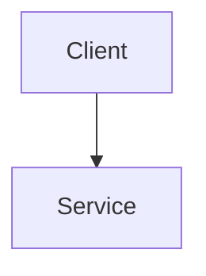

# Write Technical Architecture Document

## Purpose
Translate approved product scope into a Technical Architecture Document (TAD) that defines system structure, data boundaries, integration contracts, and technical risks clearly enough for downstream implementation.

## Use This Skill When
- A PRD has been approved and engineering design must begin.
- A major refactor, migration, or systems integration requires a formal technical plan.
- Engineers need database, service, or API definitions before implementation.

## Inputs
- Approved PRD, stories, and acceptance criteria.
- Existing system constraints, platform limitations, and operational requirements.
- Security, compliance, data, or performance constraints.

## Workflow
1. Read the approved product scope and extract required system behaviors.
2. Choose and state the system architecture pattern appropriate for the change.
3. Define the technical stack and key dependencies only where needed for architectural clarity.
4. Draft the data model with entities, relationships, types, and nullability.
5. Draft the core interfaces or API contracts, including request and response shapes.
6. Define authentication and authorization strategy when user or protected data is involved.
7. Identify technical risks, failure modes, and mitigations.
8. Compile the result into a structured TAD.

## Rules And Constraints
- Never contradict approved functional requirements.
- Be explicit about data types, nullability, and boundary ownership.
- Include security posture when the system handles user identity, personal data, or privileged operations.
- Keep the document implementation-guiding, not implementation-executing.

## Validation
- Every major functional requirement should map to a technical mechanism.
- API contracts should align with the proposed data model.
- Security and operational concerns should be addressed where relevant.
- Risks and assumptions should be visible rather than implied.

## Output Expectations
Produce a comprehensive Markdown TAD that may include Mermaid or text diagrams, schema definitions, and interface contracts.

## TAD Template
```markdown
# Technical Architecture Document

## Scope
- [What this architecture covers]

## System Overview
- [Architecture summary]

## Architecture Diagram


## Components And Boundaries
- [Component and responsibility]

## Data Model
- Entity: [Name]
  - field: [type] [nullable or required]

## API Contracts
- Endpoint: [method] [path]
  - Request: [shape]
  - Response: [shape]

## Authentication And Authorization
- [Strategy]

## Risks And Mitigations
- Risk: [description]
  - Mitigation: [response]

## Assumptions
- [Assumption]
```
